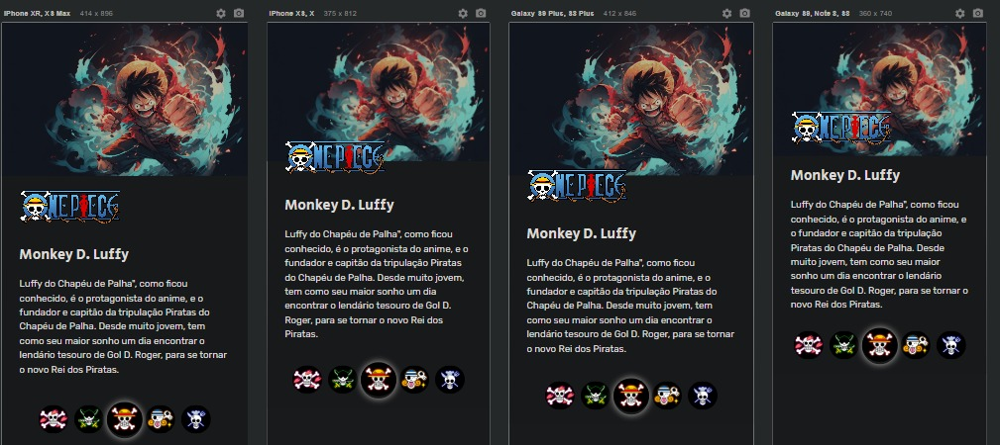
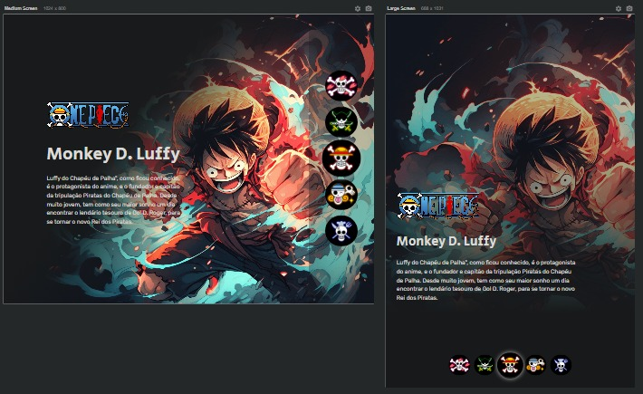

### <h1 align="center">`<>Desafios Iniciais.Py - Unimed-BH</>` </h1> 

<h2> Digital Innovation One

Desafios Inciais Python - Unimed BH

Bootcamp  Geração Tech Unimed-BH - Ciência de Dados</h2>

<h3> Tecnologias que foram utilizadas: </h3>

### <h1 align="center">`<> Projeto One Piece </>` </h1> 

<h3> Tools that were used: </h3>

##
<h4> Projeto One Piece </h4>

- Responsive Projeto One Piece website Using HTML CSS & JavaScript
- Contains animations JavaScript.
- Developed first with the Mobile First methodology, then for desktop.
- Compatible with all mobile devices and with a beautiful and pleasant user interface.

### Findings

---

